# Lab6LSC-K8S

# Tworzenie klustra:
eks-cluster.yaml:

```yaml
apiVersion: eksctl.io/v1alpha5
kind: ClusterConfig

metadata:
  name: my-cluster
  region: us-east-1

iam:
  serviceRoleARN: arn:aws:iam::160967093664:role/LabRole

nodeGroups:
  - name: ng-lab
    instanceType: t3.medium
    desiredCapacity: 2
    iam:
      instanceRoleARN: arn:aws:iam::160967093664:role/LabRole
```

## Komenda:
``` eksctl create cluster -f eks-cluster.yaml ```

logi:
```bash
2025-04-22 18:13:16 [ℹ]  eksctl version 0.207.0
2025-04-22 18:13:16 [ℹ]  using region us-east-1
2025-04-22 18:13:17 [ℹ]  setting availability zones to [us-east-1d us-east-1a]
2025-04-22 18:13:17 [ℹ]  subnets for us-east-1d - public:192.168.0.0/19 private:192.168.64.0/19
2025-04-22 18:13:17 [ℹ]  subnets for us-east-1a - public:192.168.32.0/19 private:192.168.96.0/19
2025-04-22 18:13:17 [ℹ]  nodegroup "ng-lab" will use "ami-047bdb0f2722260c0" [AmazonLinux2/1.32]
2025-04-22 18:13:17 [ℹ]  using Kubernetes version 1.32
2025-04-22 18:13:17 [ℹ]  creating EKS cluster "my-cluster" in "us-east-1" region with un-managed nodes
2025-04-22 18:13:17 [ℹ]  1 nodegroup (ng-lab) was included (based on the include/exclude rules)
2025-04-22 18:13:17 [ℹ]  will create a CloudFormation stack for cluster itself and 1 nodegroup stack(s)
2025-04-22 18:13:17 [ℹ]  if you encounter any issues, check CloudFormation console or try 'eksctl utils describe-stacks --region=us-east-1 --cluster=my-cluster'
2025-04-22 18:13:17 [ℹ]  Kubernetes API endpoint access will use default of {publicAccess=true, privateAccess=false} for cluster "my-cluster" in "us-east-1"
2025-04-22 18:13:17 [ℹ]  CloudWatch logging will not be enabled for cluster "my-cluster" in "us-east-1"
2025-04-22 18:13:17 [ℹ]  you can enable it with 'eksctl utils update-cluster-logging --enable-types={SPECIFY-YOUR-LOG-TYPES-HERE (e.g. all)} --region=us-east-1 --cluster=my-cluster'
2025-04-22 18:13:17 [ℹ]  default addons metrics-server, vpc-cni, kube-proxy, coredns were not specified, will install them as EKS addons
2025-04-22 18:13:17 [ℹ]  
2 sequential tasks: { create cluster control plane "my-cluster", 
    2 sequential sub-tasks: { 
        2 sequential sub-tasks: { 
            1 task: { create addons },
            wait for control plane to become ready,
        },
        
2 sequential tasks: { create nodegroup "ng-lab", create access entry for nodegroup "ng-lab" 
},
    } 
}
2025-04-22 18:13:17 [ℹ]  building cluster stack "eksctl-my-cluster-cluster"
2025-04-22 18:13:18 [ℹ]  deploying stack "eksctl-my-cluster-cluster"
2025-04-22 18:13:50 [ℹ]  waiting for CloudFormation stack "eksctl-my-cluster-cluster"
2025-04-22 18:14:22 [ℹ]  waiting for CloudFormation stack "eksctl-my-cluster-cluster"
2025-04-22 18:15:26 [ℹ]  waiting for CloudFormation stack "eksctl-my-cluster-cluster"
2025-04-22 18:16:30 [ℹ]  waiting for CloudFormation stack "eksctl-my-cluster-cluster"
2025-04-22 18:17:34 [ℹ]  waiting for CloudFormation stack "eksctl-my-cluster-cluster"
2025-04-22 18:18:39 [ℹ]  waiting for CloudFormation stack "eksctl-my-cluster-cluster"
2025-04-22 18:19:41 [ℹ]  waiting for CloudFormation stack "eksctl-my-cluster-cluster"
2025-04-22 18:20:45 [ℹ]  waiting for CloudFormation stack "eksctl-my-cluster-cluster"
2025-04-22 18:21:50 [ℹ]  waiting for CloudFormation stack "eksctl-my-cluster-cluster"
2025-04-22 18:22:54 [ℹ]  waiting for CloudFormation stack "eksctl-my-cluster-cluster"
2025-04-22 18:22:57 [ℹ]  creating addon: metrics-server
2025-04-22 18:22:57 [ℹ]  successfully created addon: metrics-server
2025-04-22 18:22:58 [!]  recommended policies were found for "vpc-cni" addon, but since OIDC is disabled on the cluster, eksctl cannot configure the requested permissions; the recommended way to provide IAM permissions for "vpc-cni" addon is via pod identity associations; after addon creation is completed, add all recommended policies to the config file, under `addon.PodIdentityAssociations`, and run `eksctl update addon`
2025-04-22 18:22:58 [ℹ]  creating addon: vpc-cni
2025-04-22 18:22:58 [ℹ]  successfully created addon: vpc-cni
2025-04-22 18:22:59 [ℹ]  creating addon: kube-proxy
2025-04-22 18:22:59 [ℹ]  successfully created addon: kube-proxy
2025-04-22 18:23:00 [ℹ]  creating addon: coredns
2025-04-22 18:23:00 [ℹ]  successfully created addon: coredns


2025-04-22 18:25:09 [ℹ]  building nodegroup stack "eksctl-my-cluster-nodegroup-ng-lab"
2025-04-22 18:25:09 [ℹ]  --nodes-min=2 was set automatically for nodegroup ng-lab
2025-04-22 18:25:09 [ℹ]  --nodes-max=2 was set automatically for nodegroup ng-lab
2025-04-22 18:25:10 [ℹ]  deploying stack "eksctl-my-cluster-nodegroup-ng-lab"
2025-04-22 18:25:11 [ℹ]  waiting for CloudFormation stack "eksctl-my-cluster-nodegroup-ng-lab"
2025-04-22 18:25:43 [ℹ]  waiting for CloudFormation stack "eksctl-my-cluster-nodegroup-ng-lab"
2025-04-22 18:26:39 [ℹ]  waiting for CloudFormation stack "eksctl-my-cluster-nodegroup-ng-lab"
2025-04-22 18:27:11 [ℹ]  waiting for CloudFormation stack "eksctl-my-cluster-nodegroup-ng-lab"
2025-04-22 18:28:01 [ℹ]  waiting for CloudFormation stack "eksctl-my-cluster-nodegroup-ng-lab"
2025-04-22 18:28:02 [ℹ]  nodegroup ng-lab: created access entry for principal ARN "arn:aws:iam::160967093664:role/LabRole"
2025-04-22 18:28:02 [ℹ]  waiting for the control plane to become ready
2025-04-22 18:28:03 [✔]  saved kubeconfig as "/home/soloc/.kube/config"
2025-04-22 18:28:03 [ℹ]  no tasks
2025-04-22 18:28:03 [✔]  all EKS cluster resources for "my-cluster" have been created
2025-04-22 18:28:04 [ℹ]  nodegroup "ng-lab" has 1 node(s)
2025-04-22 18:28:04 [ℹ]  node "ip-192-168-42-211.ec2.internal" is not ready
2025-04-22 18:28:04 [ℹ]  waiting for at least 2 node(s) to become ready in "ng-lab"
2025-04-22 18:29:05 [ℹ]  nodegroup "ng-lab" has 2 node(s)
2025-04-22 18:29:05 [ℹ]  node "ip-192-168-3-112.ec2.internal" is ready
2025-04-22 18:29:05 [ℹ]  node "ip-192-168-42-211.ec2.internal" is ready
2025-04-22 18:29:05 [✔]  created 1 nodegroup(s) in cluster "my-cluster"
2025-04-22 18:29:07 [ℹ]  kubectl command should work with "/home/soloc/.kube/config", try 'kubectl get nodes'
2025-04-22 18:29:07 [✔]  EKS cluster "my-cluster" in "us-east-1" region is ready
```


## NFS Server & Provisioner

```bash
$ helm repo add nfs-ganesha-server-and-external-provisioner https://kubernetes-sigs.github.io/nfs-ganesha-server-and-external-provisioner/
$ helm install my-release nfs-ganesha-server-and-external-provisioner/nfs-server-provisioner
```

## Persistent Volume Claim

```yaml
apiVersion: v1
kind: PersistentVolumeClaim
metadata:
  name: web-content-pvc
spec:
  accessModes:
    - ReadWriteMany
  resources:
    requests:
      storage: 500Mi
  storageClassName: "nfs"
``` 

## Deployment

```yaml
apiVersion: apps/v1
kind: Deployment
metadata:
  name: web-server
spec:
  replicas: 1
  selector:
    matchLabels:
      app: web
  template:
    metadata:
      labels:
        app: web
    spec:
      containers:
        - name: nginx
          image: nginx
          volumeMounts:
            - mountPath: "/usr/share/nginx/html"
              name: content
      volumes:
        - name: content
          persistentVolumeClaim:
            claimName: web-content-pvc
```
## Service

```yaml
apiVersion: v1
kind: Service
metadata:
  name: web-service
spec:
  selector:
    app: web
  ports:
    - port: 80
      targetPort: 80
  type: LoadBalancer
```
## Job 

```yaml
apiVersion: batch/v1
kind: Job
metadata:
  name: copy-content
spec:
  template:
    spec:
      containers:
      - name: init
        image: busybox
        command: ['sh', '-c', 'echo Hello from NFS > /mnt/data/index.html']
        volumeMounts:
        - name: content
          mountPath: /mnt/data
      volumes:
      - name: content
        persistentVolumeClaim:
          claimName: web-content-pvc
      restartPolicy: OnFailure
```


## Web Server


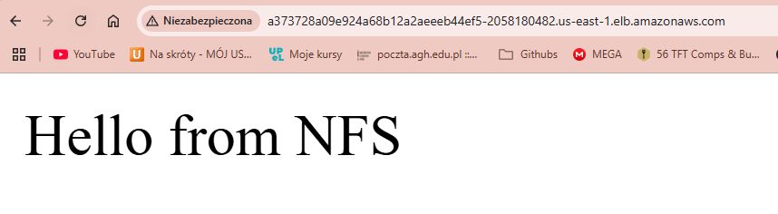

## Cluster

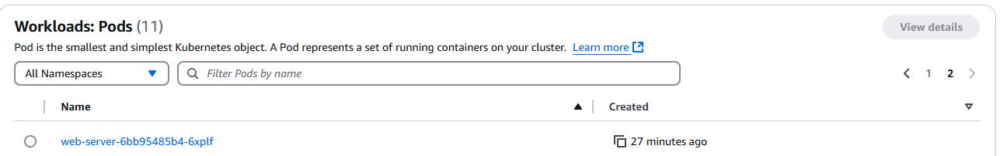
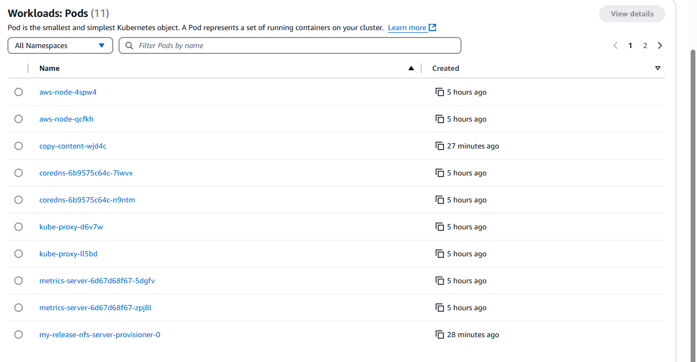
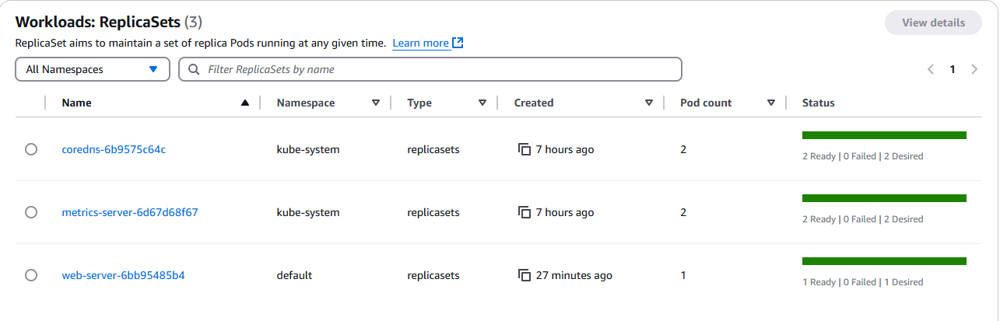
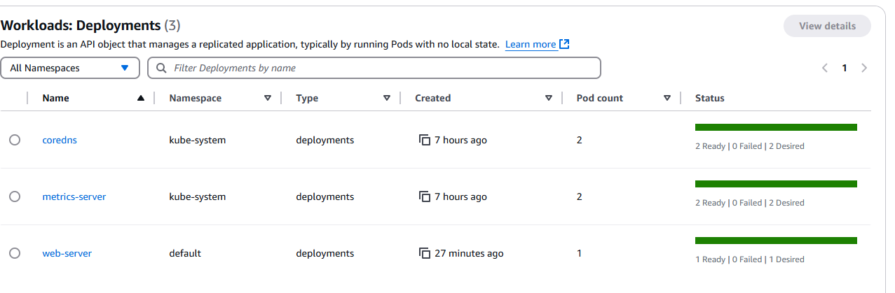
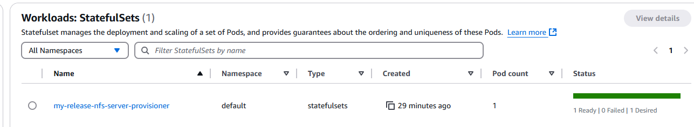
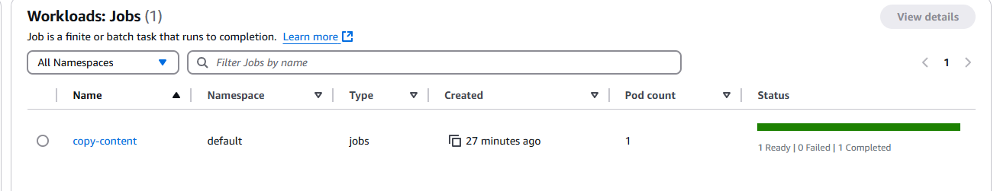

## Nodes
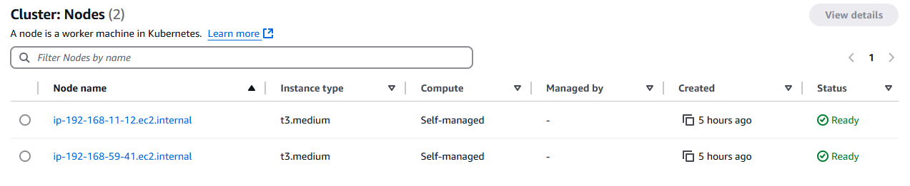

## Namespaces
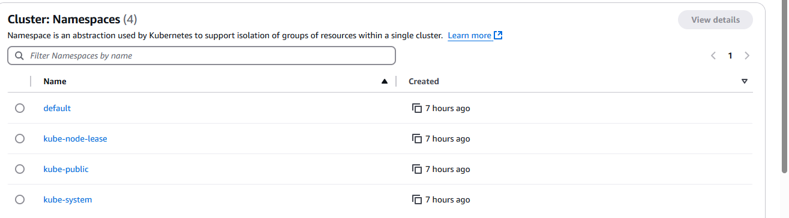

## Persistent Volumes Claims
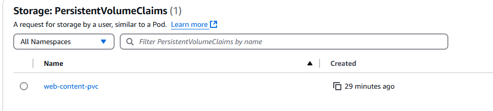

## Persistent Volumes
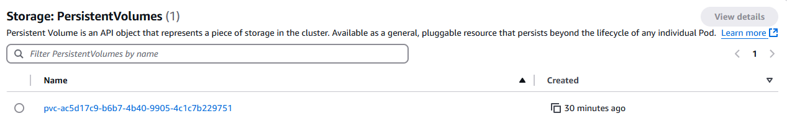
 
## How it works:

- AWS EKS Cluster - a cluster contains the control plane and worker nodes. The control plane schedules and manages workloads, while the nodes run containers.
- Persistent Volume (PV) + Persistent Volume Claim (PVC) - PV is a piece of storage in the cluster, while PVC is a request for storage by a user. The NFS server acts as the backend storage provider. Nginx pod uses volumeMounts to serve files directly from the persistent volume via the PVC.
- Kubernetes Deployment (nginx) - a deployment manages a set of replicas of the nginx container. It ensures that the desired number of replicas are running and available. Connects to the PVC to read the content.
- Kubernetes Job - this pod runs once and copies index.html into the shared volume. it mounts the same PVC as the nginx pod, allowing it to write to the shared storage. The job runs a simple command to create an index.html file in the shared volume.
- Kubernetes Service - a service exposes the nginx deployment to the outside world. It creates a load balancer that routes traffic to the nginx pods. The service uses the selector to match the pods with the label "app: web".

### One time:
Job Pod -> Mounts PVC -> Writes index.html to volume

### Use case:
User -> ELB (LoadBalancer Service) -> nginx Pod (via Deployment) -> Reads from PVC -> Binds to PV

PVC <--> PV

### Architecture:
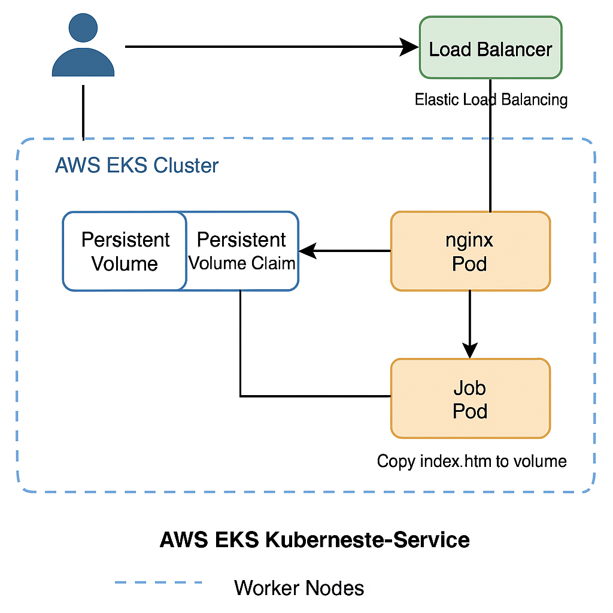